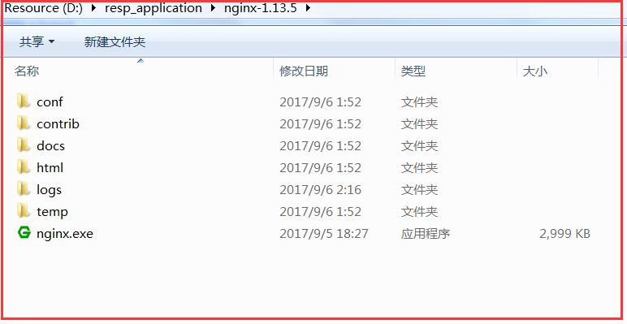
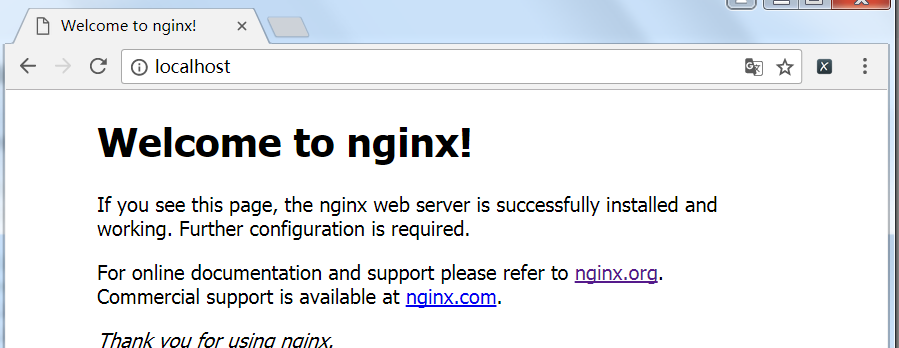

# Nginx入门

## Nginx安装

Nginx下载地址： [下载地址](https://nginx.org/en/download.html "官方下载地址")

下载对应的版本的nginx压缩包，解压到任意文件夹即可。



双击该目录下的nginx.exe，即可启动nginx服务器。

命令行执行nginx命令，也会直接启动nginx服务器。

打开[http://localhost](http://localhost)，出现下图表示nginx已经成功运行。



## nginx命令行

命令行进入nginx根目录，执行以下命令。
```bash
# 强制停止nginx服务器，有未处理的数据，丢弃
nginx -s stop
# 有未处理的数据，等待处理完成之后停止
nginx -s quit
# 重新加载配置文件
nginx -s reload
# 重写打开log文件
nginx -s reopen
```
    nginx重新加载配置文件的过程，主进程接收到加载信号后，首先会校验配置的语法，然后生效新的配置；如果成功，则主进程会启动新的工作进程，同时发送终止信号给旧的工作进程；否则主进程回退配置，继续工作。
    旧的工作进程收到终止信号后，会停止接收新的连接请求，直到所有现有的请求处理完，然后退出。

## nginx配置
nginx是一个功能非常强大的web服务器，反向代理服务器和邮件服务器。项目使用中，使用最多的三个核心功能是反向代理，负载均衡和静态服务器。

这三个不同的功能的使用，都跟nginx的配置密切相关，nignx服务器的配置信息主要集中在nginx.conf这个配置文件中，并且所有的可配置选项大致分为六部分。


``` bash
main #全局配置

events # nginx工作模式配置

http # http设置

server # 服务器主机配置

location #路由配置

upsteam #负载均衡配置
```

nginx的配置由特定的指令符分为多个不同的模块。指令符分为简单指令和块指令。

1.简单指令格式，name parameters;

2.块指令格式，结束标识符不是分号，而是大括号{}，块指令内部可以包含简单指令和块指令，可以称块指令为上下文。

conf文件中，所有不属于块指令的简单指令都属于main上下文。http块指令属于main上下文，server块指令http上下文。

### 配置静态访问

Web Server很重要一部分工作就是提供静态页面的访问，nginx可以通过不同的配置，根据request请求，从本地的目录提供不同的文件返回给客户端。

通常情况下，conf文件存在多个server块，通过listen的端口和server_name进行区分，对不同的请求提供不同的服务。

```bash
 server {
     listen 80;
     server_name localhost;
     ...
 }

 server {
     listen 7823;
     server_name localhost;
 }
```

当nginx决定哪一个server处理客户端请求后，会解析request中URI，然后匹配server块中的location指令的参数

/会匹配所有的请求，一般都会默认存在。root指向重定向后uri的资源查找路径，index指向首页index文件的名称，可以配置多个，参数以空格分开，按顺序查找。

多个location指令块匹配到，nginx的选择策略是最长前缀匹配原则。

```bash
server {
    listen 80;
    server_name localhost;

    location / {
        root html;
        index index.html index.htm;
    }

    location /imgs {
        root .;
        index 1.gif
    }
}
```

### location指令

nginx的location指令是配置的核心，用于匹配client请求uri的path部分，然后对不同的请求提供不同的静态内容，或者通过反向代理重定向到内部的server。

location指令的参数：

1, 可以是一个前缀字符串，参数修饰符分为：

无任何修饰符；

=修饰符定义一个精确匹配，匹配优先级最高；

^~修饰符，对应的参数作为最长字符串匹配到后，不会继续去搜索参数为正则表达式的loation

2, 也可以是一个正则表达式：

~ 修饰符：location参数部分大小写敏感；

~* 修饰符，location参数部分大小写不敏感。

```bash
    location ~* \.(gif|jpg|jpeg)$ {
        root images;
        index 1.gif;
    }
```

location匹配的过程：

1、首先nginx会把request的uri在location正常字符参数中匹配出符合的最长字符串，并保存这个结果。

2、如果最长前缀匹配结果前面有^~修饰符，那么停止继续搜索。

3、如果最长匹配结果有=修饰符，也会停止继续搜索。

4、去匹配参数为正则表达式的所有location，根据location的配置顺序，在匹配到第一个正则表达式时，停止搜索其它的正则表达式。


## 负载均衡

Nginx提供的负载均衡策略有2种：内置策略和扩展策略。内置策略为轮询，加权轮询，Ip hash。扩展策略，可以实现所有的负载均衡算法。

轮询为依次访问各个服务器，加权轮询为某些权重高服务器流量多。

IP Hash算法，对客户端请求的ip进行hash操作，然后根据hash结构将同一个客户端ip的请求分发给同一个服务器进行处理，可以解决session不共享的问题。

## 配置Proxy Server

nginx使用频繁的另一个服务就是作为代理服务器，提供将外部client的请求反向代理给内部被代理的server，然后接收proxied server的响应，并回包给client。

proxy_pass指令：

该指令是反向代理的基本指令，用于设置代理服务器的协议和地址。对于一个client的请求，proxy_pass指令通过以下方式进行uri的转发：

```bash
location /yyy/ {
    proxy_pass https://subdomain.domain.com/;
    proxy_hide_header X-Amz-Id-2;
}
```

1、如果proxy_pass指令的参数没有URI，那么请求的URI会被原样传递给internal server。

2、如果proxy_pass指令的参数含有URI，client请求的URI匹配该location的部分将会被proxy_pass的path参数替换。

3、在location指令的参数是一个正则表达式的时候，这个情况下，proxy_pass的参数应该不含URI部分

4、当URI在location指令模块中被rewrite指令改变后。

proxy_pass_header,filed 参数是http所有的header的名字。


    该指令用于特定的http header从proxy server传回给client。默认情况下有些header是不会回传给client的。默认情况下，不会回传data,server,x-pad,x-accel-等

proxy_hide_header指令，用于限定哪些header不回传给client。

proxy_set_header field value, 该指令用于将client传递给proxy server的request header重新定义或者添加字段，value可以是文本，变量和两者的结合。set的value为空，这个header不会传递给server。

默认只要 Host($proxy_host)和Connection(close)会被重新定义。


