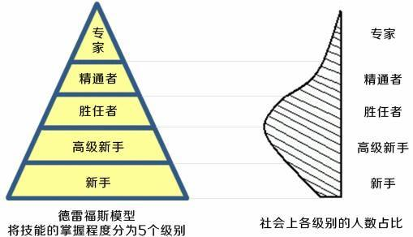

# 普通程序员和大神级的程序员有什么区别

## 德雷福模型

这个模型的含义是：将所有需要专业技能的从业者能力划分为5个等级，通过描述从新手到专家的成长，来让我们了解到各个阶段的从业者特征，以及他们需要如何去做才能够继续成长。

重点：

1、从新手到专家要经理巨大的变化

2、德雷福模型描述了我们的能力，态度，素质和视角在不同的技术水平下是如何变化的，以及为什么会有变化

3、德雷福模型描述了从新手到专家所经历的5个阶段

4、这个阶段不是用来描述所有领域的，只是用来描述你在特定技能领域内所处的某个阶段，一个人可以是程序员专家，也是唱歌新手

## 新手

新手在该领域很少或根本没有经验

新手非常在乎他们能否成功，没有太多经验指导他们，不知道自己的行为是对是错

如果给新手提供与情景无关的规则去参照，他们就会变得能干起来

新手是每个开始学习任何技能的人一开始的阶段，这一阶段的人，经验很少或者根本就没有，所谓的经验，指的是，通过实践这项技术促进了思维的改变。经验指的并不是资历，在开发这个行业尤其如此，重复做类似于吃饭喝水一样的写需求，这并不是经验。拿工作一年的技术重复10年，也只能算一年经验。虽然面试官会把你当做“高资历”的开发者，模型衡量时请不要做这种掩耳盗铃的事情。

    第一次遇到程序报错时的场景吗?大部分人的解决方式是靠猜或者寻求帮助，新手时期正常的表现。
    学会了异常，调试之后，碰见红红的报错还心慌吗？获得了经验的同学，就会通过提示信息来寻找问题的原因。
    获得经验之后的思维转变。

新手非常在乎他们能否成功，没有太多经验指导他们，不知道自己的行为是对是错。因为新手处理任务时的心态比较紧张，在乎得失，有手足无措的感觉。不具备判断对错好坏的能力，还是会下意识来寻求权威的判断。

新手提高与情景无关的规则去参照，他们就会变得能干起来。给新手安排任务的时候，丢给他一个大的模糊的需求概念时，他往往会比较迷茫，新手需要更高层次的人来帮忙吧事情拆解，安排成明确的指令，一步步照做就行，因为他们已经失去了思考，完全交给了所谓的权威。

https://www.zhihu.com/question/59351128/answer/165387453

